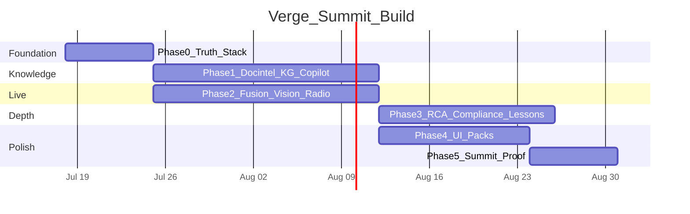

# Verge — Phased Build Plan (Depth)

**Companion to:** [`PRODUCT_AUDIT_AND_ROADMAP.md`](./PRODUCT_AUDIT_AND_ROADMAP.md)  
**Principle:** Open-source is the default. Paid stack only where it clearly wins on usefulness, latency, or summit reliability — and you already hold keys for several of those.  
**Quality bar:** A feature is not “done” when it demos. It is done when it meets its **Usefulness DoD** below and has an eval or operator-visible proof.

---

## 1. How to read this plan

| Term | Meaning |
|---|---|
| **Phase** | Time-boxed outcome with hard exit criteria |
| **Track** | Parallel workstream inside a phase (can run with 2–3 builders) |
| **DoD** | Definition of Done — usefulness threshold, not checkbox UI |
| **OSS** | Prefer; self-hostable; Apache/MIT/BSD-class |
| **Paid / hosted** | Use when OSS quality gap is material for summit or plant ops |

**Global rules for every phase**
1. P1: safety path never depends on LLM/cloud.  
2. P4: no fake KPIs — empty/degraded is allowed, fiction is not.  
3. Every shipped claim has a harness command or labeled reconstruction.  
4. Instrument Paper UI: craft + truth together; never polish a lie.

---

## 2. Technology decisions (OSS-first, paid where it earns its keep)

### 2.1 Stack matrix

| Concern | Primary (OSS / owned) | Secondary / paid | Why this choice | Already in Verge? |
|---|---|---|---|---|
| API gateway | FastAPI + Uvicorn | — | Fits monorepo; SSE/WS ready | Yes |
| Operator UI | React + Vite + Tailwind + MapLibre | — | Console already Instrument Paper | Yes |
| Event bus | Redpanda (Kafka API) | — | Edge-friendly, OSS | Deploy yes |
| OLTP + geo | Postgres + PostGIS | — | Twin, permits, audit | Deploy yes |
| Time-series | TimescaleDB | — | Sensor history for RCA/charts | Deploy yes |
| Object store | MinIO | — | Docs, frames, evidence | Deploy yes |
| Graph DB | **Neo4j Community** | Neo4j Enterprise later | Industrial KG queries; Cypher UX | Deploy yes |
| Auth | Keycloak | — | OIDC/RBAC OSS | Deploy yes |
| Embeddings (local) | **sentence-transformers** / bge-m3 on Vultr GPU | OpenAI embeddings via aimlapi | Air-gap + cost control | Partial |
| Vector / memory | **Cognee** (you have) + **pgvector** mirror | — | Cognee for cognify/graph-memory; pgvector as air-gap fallback | Cognee yes |
| LLM synthesis | **aimlapi** (you have) | **vLLM / Ollama** on Vultr | Swap via `LLMProvider` | Yes |
| Speech / radio | **Speechmatics** (you have) | **Faster-Whisper** OSS fallback | Speechmatics quality for radio; Whisper for offline drill | Speechmatics yes |
| Document parse | **Docling** (IBM OSS) | Unstructured OSS | Best layout/tables/PDF; industrial-friendly | **Add** |
| Doc → graph extract | **Docling-Graph** | Custom Pydantic NER | Validated entities + NetworkX → Neo4j Cypher | **Add** |
| OCR (scans) | Docling OCR + **PaddleOCR** / Tesseract | — | Scanned forms & Indian plant paperwork | **Add** |
| Ops vision | **Ultralytics YOLO** + OpenCV | VLM via aimlapi for hard PPE | Real-time PPE/person/zone | Partial |
| P&ID digitisation | OpenCV + YOLO symbol models (OSS samples) + Docling text | AWS Bedrock P&ID guidance only if OSS accuracy fails | Keep OSS path first; paid only if eval fails | **Add** |
| Workflow / agents | Hand-rolled tool loop (`packages/agents`) | — | No LangChain lock-in (P2) | Yes |
| Observability | Prometheus + Grafana + OTel | — | Already scaffolded | Partial |
| GPU host | **Vultr** GPU VM | Local RTX | Docling VLM, YOLO, embeddings, vLLM | You have |
| Feature flags / jobs | Python workers + Redis | — | Ingest queues, radio chunks | Redis in deploy |

### 2.2 Paid stack — keep / add / skip

| Service | Verdict | Notes |
|---|---|---|
| **Cognee** | **KEEP — core for Knowledge wedge** | Primary cognify + retrieval. Budget for summit datasets. |
| **Speechmatics** | **KEEP — core for radio/voice** | Better than Whisper for noisy radio; keep Faster-Whisper as degrade path. |
| **aimlapi** | **KEEP — synthesis / VLM / agents** | Route by task; don’t use for safety interlock. |
| **Vultr GPU** | **KEEP — compute backbone** | Run Docling-heavy jobs, YOLO, embeddings, optional vLLM. |
| Neo4j Aura / Enterprise | **OPTIONAL later** | Community enough for summit; Enterprise if clustering/RBAC on graph needed. |
| Pinecone / Weaviate Cloud | **SKIP for now** | pgvector + Cognee cover vectors; avoid another silo. |
| LangSmith / proprietary agent clouds | **SKIP** | Keep agents in-repo; auditability matters. |
| Azure Document Intelligence / AWS Textract | **CONTINGENCY only** | If Docling+PaddleOCR entity F1 &lt; DoD on *your* scanned plant docs, evaluate one paid OCR for 2 weeks. |
| Twilio / MSG91 SMS | **ADD when alerting demo needs real SMS** | Orchestrator already degrades without provider. |
| Map tiles (MapTiler / self-hosted tiles) | **OPTIONAL** | Blank plant style is fine; add CAD overlay from GeoJSON first. |

### 2.3 Suggested Vultr GPU workload split

| Workload | Model / tool | Priority |
|---|---|---|
| Docling convert + OCR batch | Docling (+ Granite-Docling if useful) | P0 Knowledge |
| Embeddings | bge-m3 or nomic-embed | P0 Copilot |
| YOLO ops vision | yolov8/11 n or s | P0 Live |
| Optional local LLM | Qwen2.5-14B / Llama via vLLM | P1 air-gap narrative |
| P&ID symbol detector | fine-tuned YOLO on symbol set | P1 mid phases |

---

## 3. Usefulness Definition of Done (per feature family)

A feature ships only when **all** rows for that family are green.

### 3.1 Live Risk
| Feature | Usefulness DoD |
|---|---|
| Compound finding | Fires on real multi-signal convergence; shows lineage chips that open evidence; baselines miss ≥1 of the demo incidents |
| Lead-time band | Band matches minutes-to-breach class on replay; UNKNOWN when data degraded — never a fake countdown |
| SIMOPS | Hot-work ∩ confined-space (or pack rules) in adjacent zones produces finding without single-sensor alarm |
| Map / geo | Finding select flies to zone; ≥1 sensor has real XY; worker counts from API |
| Emergency | Declare → freeze hash → muster expected/accounted/missing from API — **no hardcoded 42/43** |
| Shadow mode | Toggle works; shadow findings excluded from live alert path |

### 3.2 Living Knowledge
| Feature | Usefulness DoD |
|---|---|
| Doc ingest | Upload PDF/DOCX/XLSX/image → searchable within ≤3 min (GPU path) with page-level chunks |
| Entity extract | Equipment-tag F1 ≥ **0.85** on labeled gold set (≥50 docs mixed types) |
| KG linkage | ≥ **70%** of extracted equipment tags resolve to twin nodes (or explicit `unresolved`) |
| Copilot answer | On expert Q-set: groundedness ≥ **0.90**, citation precision ≥ **0.85**, refuses when corpus insufficient |
| Time-to-answer | Median copilot answer &lt; **15s**; beats keyword search baseline on same Q-set (human timed) |
| Mobile field | Same citation-quality answers on phone layout; one-thumb ask + open source doc |

### 3.3 Vision / Voice
| Feature | Usefulness DoD |
|---|---|
| CCTV/drone | Continuous or clip job produces detections with frame URI in MinIO + lineage on finding |
| PPE | Measured P/R on your footage before any “PPE violation” claim; else labeled advisory |
| Radio | Transcript + structured hazard event within ≤30s of chunk; appears in finding or KG |
| Handover | Voice → structured open hazards list usable in shift UI |

### 3.4 Maintenance / Compliance / Lessons
| Feature | Usefulness DoD |
|---|---|
| RCA support | For a seeded failure, agent returns ≥3 cited evidence items (WO + sensor window + manual) |
| Compliance gap | Precision/recall ≥ **0.80** on gold gap set; UI shows evidence level, not fake % “compliant” |
| Lessons push | When live condition matches a past lesson, Mission Control shows proactive card with link to incident |

### 3.5 Platform
| Feature | Usefulness DoD |
|---|---|
| Plant pack switch | 3 packs switch twin+rules+corpus without redeploy |
| Degrade matrix | Kill Cognee / Speechmatics / LLM / Redpanda — banners show, safety core still evaluates |
| Auth roles | Officer / Field / Auditor see correct surfaces when auth on |

---

## 4. Phase overview

```text
Phase 0  Foundation & Truth          ~1 week
Phase 1  Knowledge Spine MVP         ~2–3 weeks
Phase 2  Live Fusion (sensors+CV+radio) ~2–3 weeks  (overlaps Phase 1)
Phase 2.5 GenAI Core (orchestrator + GraphRAG + validators) ~1.5–2 weeks  ← NEW (see GENAI_ARCHITECTURE_AUDIT.md)
Phase 3  Specialist Agents (RCA/compliance/lessons) ~2 weeks
Phase 4  Multi-pack + Premium UI     ~1.5–2 weeks
Phase 5  Summit Hardening & Proof    ~1 week
Phase 6  Post-summit Plant Scale     ongoing
```

**GenAI audit (2026-07-18):** [`GENAI_ARCHITECTURE_AUDIT.md`](./GENAI_ARCHITECTURE_AUDIT.md) — keep P1 safety core LLM-free; deepen advisory GenAI (orchestrator + specialists + GraphRAG + validators + agent evals).



*(Dates illustrative — slide to your summit date; keep phase order and exit criteria.)*

---

## 5. Phase 0 — Foundation & Truth (~1 week)

**Goal:** Stop lying; wire paid/OSS keys; freeze architecture contracts so Phase 1–2 don’t thrash.

### Tracks
| Track | Work | Owner focus |
|---|---|---|
| **0A Truth** | Seed opt-in; kill KnowledgeGraphViz hardcode; kill muster `42/43`; kill fake fleet TRIR/bulletins; photo attach real or remove | Console + API |
| **0B Stack bring-up** | Cognee + Speechmatics + aimlapi + Vultr GPU smoke; Neo4j + MinIO + Timescale green in compose | Infra |
| **0C Contracts** | DocumentAsset, EntityMention, VoiceEvent, VisionDetection event schemas in `packages/schema` + contracts | Schema |
| **0D Packs** | Lock **3 summit packs** + folder layout `plants/packs/<id>/` | Product |

### Deliverables
- `VERGE_SEED=off\|demo` respected in API factory  
- Real graph endpoint returns twin+permits+findings (even if sparse)  
- `.env.example` documents all keys; health shows degraded components honestly  
- ADR note: Docling + Docling-Graph + Cognee + Neo4j memory path  

### Exit criteria
- [ ] Clean boot shows **no fabricated findings** unless demo seed on  
- [ ] `GET /api/ops/status` + degradation strip reflect real Cognee/Speechmatics/LLM  
- [ ] Three pack IDs named; demo script Act 1–5 one-pager exists  

---

## 6. Phase 1 — Knowledge Spine MVP (~2–3 weeks)

**Goal:** Challenge B becomes a **working product**, not a chat panel over stubs.  
**Usefulness north star:** A field tech gets a cited answer faster than searching 7 systems.

### Week-by-week

#### Week 1.1 — Ingest foundation
| Item | Detail |
|---|---|
| New service | `services/docintel/` |
| Pipeline | upload → MinIO → Docling convert → chunk (page/section) → embed → Cognee add/cognify + Postgres doc registry |
| Formats v1 | PDF, DOCX, XLSX, PNG/TIFF (scanned), TXT/MD |
| API | `POST /api/docs/ingest`, `GET /api/docs`, `GET /api/docs/{id}`, `GET /api/docs/{id}/chunks` |
| Queue | Redis job for async processing; UI shows `queued/processing/ready/failed` |
| OSS | Docling + PaddleOCR/Tesseract via Docling | 

**DoD:** 20 mixed docs processed; each has previewable chunks with page refs.

#### Week 1.2 — Entities + ontology
| Item | Detail |
|---|---|
| Extract | Docling-Graph / LLM extract into Pydantic: EquipmentTag, Person, Date, ClauseRef, FailureCode, Parameter |
| Resolve | Match tags to twin equipment (`P-3` ↔ `EQ-P-3`) with confidence |
| Graph | Upsert Neo4j: `(:Document)-[:MENTIONS]->(:Equipment)` etc. |
| Package | `packages/ontology/` — schema versioned YAML + Cypher templates |
| Console | Replace fake viz with live Cypher-backed explorer (filter by type) |

**DoD:** Entity F1 measured on first gold 20 docs; unresolved tags listed, never silently dropped.

#### Week 1.3 — Expert Copilot
| Item | Detail |
|---|---|
| Retrieve | Cognee search + optional pgvector hybrid |
| Answer | aimlapi grounded synthesis; refuse if &lt;N citations |
| API | Expand `POST /api/memory/query` → `POST /api/knowledge/ask` (site+pack scoped) |
| UI | `/knowledge` — chat + citation rail + PDF page preview (pdf.js OSS) |
| Mobile | Field layout of same ask path |
| Eval | `eval/knowledge/` — 30 expert questions, citation precision, latency |

**DoD:** Copilot usefulness bars in §3.2 met on pack #1 corpus (≥50 docs).

### Phase 1 exit criteria
- [ ] Docintel processes the 4 core types: SOP, WO export, inspection, regulation excerpt  
- [ ] Graph UI shows **zero hardcoded demo nodes**  
- [ ] Copilot answers 30/30 questions with citations or honest insufficient  
- [ ] Time-to-answer benchmark recorded vs manual search  

### Risks & mitigations
| Risk | Mitigation |
|---|---|
| Docling slow on CPU | Batch on Vultr GPU; show progress |
| Tag mismatch (`P-3` vs `PUMP-3`) | Alias dictionary per pack + fuzzy resolve with review queue |
| Cognee outage | pgvector fallback retrieve; degrade banner |

---

## 7. Phase 2 — Live Fusion (~2–3 weeks, parallel with Phase 1)

**Goal:** Challenge A runs on **your streams**, and knowledge facts can participate as predicates.

### Track 2A — Sensors & risk depth
| Work | Detail |
|---|---|
| Sensor kinds | wind, temp, pressure, level, vibration, O2, toxics… in schema + twin packs |
| Predicates | Generalise `gas_near_threshold` → `sensor_near_threshold`; add `maintenance_open`, `worker_in_zone`, `adjacent_permit`, `voice_hazard_mention`, `vision_detection`, `open_capa` |
| Rules | Expand starter library per pack (target **60+** rules across packs) |
| Runner | Persist dedupe + permit window; contract validate all ingest |
| Eval | Compound-only catch rate column in harness |

**DoD:** At least 3 compound classes fire on live or replay streams with full lineage.

### Track 2B — Vision ops
| Work | Detail |
|---|---|
| Ingest | RTSP worker + file/drone upload API |
| Models | Ultralytics person/PPE/zone; store frames MinIO |
| UI | Vision Ops strip / panel: cameras, last detections |
| Link | Detections → optional finding contributor or standalone advisory |
| Eval | Confusion matrix on labeled clips before slogans |

**DoD:** Live or recorded CCTV produces lineage-backed detections in UI within 5s of event (GPU path).

### Track 2C — Radio / voice intelligence
| Work | Detail |
|---|---|
| Ingest | Audio chunk upload or stream bridge → Speechmatics |
| Structure | Hazard lexicon + LLM-assisted extract with regex fallback (existing voice pattern) |
| Emit | `voice-event` on bus → risk predicate + KG `(:VoiceEvent)-[:ABOUT]->(:Zone\|:Equipment)` |
| UI | Live transcript ticker on Mission Control (privacy: role-gated) |
| Fallback | Faster-Whisper on Vultr if Speechmatics down |

**DoD:** Scripted radio line (“gas smell near battery”) creates structured event and contributes to a finding or lesson card.

### Track 2D — Fusion moment
| Work | Detail |
|---|---|
| Investigator | Tools: telemetry, permits, **real KG**, Cognee docs, clauses |
| Finding detail | Tabs: Live / Knowledge / Graph / Investigate / Respond |
| Counterfactual | Keep “risk drops if permit closed” + add “relevant SOP section” |

**DoD:** One end-to-end Act 3 demo: live convergence + cited SOP + OISD clause + voice snippet.

### Phase 2 exit criteria
- [ ] Sims **or** your live MQTT feed → findings on console without seed findings  
- [ ] Vision + voice each contribute at least once to a demo finding lineage  
- [ ] Degrade: stop Speechmatics → Whisper or silent voice with banner; risk still runs  

---

## 7.5 Phase 2.5 — GenAI Core (~1.5–2 weeks) **NEW**

**Goal:** Use modern advisory GenAI (2026 patterns) without polluting the safety core.  
**Full rationale:** [`GENAI_ARCHITECTURE_AUDIT.md`](./GENAI_ARCHITECTURE_AUDIT.md).

| Track | Work | DoD |
|---|---|---|
| **G1 Orchestrator** | Evolve `packages/agents` Investigator → **Advisory Orchestrator** that fans out to specialists and merges a JSON brief | One finding → brief with specialist step traces |
| **G2 Specialists** | Telemetry + Knowledge + Compliance specialists (own tools, clean context) | Each returns distilled evidence, not raw dumps |
| **G3 GraphRAG** | Cognee ON + Neo4j query templates as Knowledge tools | Multi-hop cite: doc → equipment → zone → clause |
| **G4 Validator** | Deterministic gate: no invented twin tags; citations required for “recommended” barriers | Invented-tag rate **0** on gold set |
| **G5 Multimodal tools** | Melia English transcript + vision events as investigator tools | Brief can mention radio + camera lineage |
| **G6 Evals** | `eval/agents/` gold briefs (groundedness, citation precision) | Harness command in CI or nightly |

**Exit criteria**
- [ ] Orchestrator + ≥3 specialists live behind `POST /api/findings/{id}/investigate`  
- [ ] Cognee cognify path green on ingest  
- [ ] Validator blocks uncited / invented-tag recommendations  
- [ ] Agent eval suite exists with ≥10 gold briefs  
- [ ] `verge_risk` still cannot import `verge_llm` (CI lint)

---

## 8. Phase 3 — Specialist Agents Depth (~2 weeks)

**Goal:** RCA, compliance, and lessons are **specialists under the same orchestrator**, not isolated chat panels.

### 3A Maintenance & RCA specialist
| Piece | Detail |
|---|---|
| Service | `services/maintenance/` |
| Data | WO CSV/API, failure codes, OEM manuals (via docintel), Timescale windows |
| Agent | Specialist tools: `list_work_orders`, `sensor_window`, `manual_search`, `similar_failures` |
| UI | `/maintenance` — asset page: history, recommendations, evidence |
| DoD | RCA brief with ≥3 citations on gold asset; schedule suggestion explains “why”; passes G4 validator |

### 3B Compliance specialist & QMS
| Piece | Detail |
|---|---|
| Packs | Versioned clause JSON: OISD subset + Factory Act + PESO + env (start curated, honest) |
| Mapping | Clause → required evidence types → observed docs/inspections/rules |
| Agent | Compliance Specialist called by orchestrator + gap board UI |
| UI | Gap board with disclaimer levels: platform / configured / observed / attested / not-evidenced |
| Eval | Gold gap set precision/recall |
| DoD | No “81% compliant” without evidence drill-down |

### 3C Lessons Learned specialist
| Piece | Detail |
|---|---|
| Service | `services/lessons/` |
| Mine | Closed findings, near-miss voice, NCR docs, incident PDFs |
| Match | Embeddings + rule features vs live RiskContext |
| Push | Proactive card on Mission Control (`LESSON` severity) via orchestrator or rule+embed match |
| DoD | At least one proactive lesson fires in summit rehearsal script |

### Phase 3 exit criteria
- [ ] RCA + compliance + lessons each have a 60-second demo beat  
- [ ] All agent outputs cited or degraded — never invented work orders  
- [ ] All three register as specialists on the Phase 2.5 orchestrator  

---

## 9. Phase 4 — Multi-pack + Premium UI (~1.5–2 weeks)

**Goal:** Look and feel like a category-defining product; prove platform breadth.

### 4A Plant packs
| Pack | Must include |
|---|---|
| Steel / coke-oven | Existing Vizag sharpened |
| Refinery / tank | Existing Jaipur sharpened |
| Third (chemicals **or** power) | New twin + rules + ≥40 docs + 15 knowledge Qs |

Switcher in header: changes twin geo, rules, corpus dataset, eval fixtures.

### 4B UI craft (usefulness-first polish)
| Surface | Craft DoD |
|---|---|
| Mission Control | One composition: map + board + now-strip (sensors/radio/vision chips) |
| Knowledge | Citation rail + page preview; empty corpus CTA to ingest |
| Graph | Live, filterable, object drill-in |
| Finding object | Full page, not only modal |
| Mobile field | Ask / ack / photo evidence / muster |
| Wallboard | Dim theme, IMMINENT-first, 10m readability |
| Admin | Sectioned Plant IT — no equal-weight dump |

Motion: stream tick, map fly-to, IMMINENT annunciator, citation pulse — then stop.

### Phase 4 exit criteria
- [ ] Blind tester finds answer in Knowledge &lt;15s  
- [ ] Blind tester understands a NEAR finding without training (&lt;30s)  
- [ ] Pack switch &lt;3s perceived  

---

## 10. Phase 5 — Summit Hardening & Proof (~1 week)

**Goal:** Stage reliability + honest metrics on screen.

| Day focus | Work |
|---|---|
| D1 | Full degrade rehearsal (kill each dependency) |
| D2 | Eval boards: safety FNR + knowledge scorecard wired to `eval/out` |
| D3 | Demo script lock + backup offline clips/docs cached in MinIO |
| D4 | Auth roles for stage accounts; no open admin mutations |
| D5 | Deck numbers = harness only; architecture diagram updated |
| D6–7 | Dry runs; fix only P0 breaks |

### Exit criteria
- [ ] Two clean dry-runs of full Acts 1–5  
- [ ] All slide metrics reproducible via `make eval` + `make eval-knowledge`  
- [ ] Incident USB/offline pack for venue wifi failure  

---

## 11. Phase 6 — Post-summit plant scale (ongoing)

| Work | Detail |
|---|---|
| Real plant packs | Father’s / partner sites via commissioning |
| Connector certification | PI/PHD/Maximo/SAP as data arrives |
| Shadow 30 days | First unbiased FPR/FNR |
| Prod hardening | Auth default-on, WORM evidence, K8s hardening ([backend audit](./backend_architecture_audit.md)) |
| P&ID CV v2 | If Phase 1–2 text extract insufficient, invest YOLO symbol models on Vultr |

---

## 12. Repo layout target (end of Phase 3)

```text
packages/
  ontology/          # NEW — entity/relation schemas
  memory/            # expand — multi-corpus, citations
  agents/            # Phase 2.5 — orchestrator + specialists + validator
services/
  docintel/          # NEW — Docling pipeline
  maintenance/       # NEW — RCA / WO intelligence
  lessons/           # NEW — pattern push
  knowledge/         # optional façade API or under api/routes
  risk-engine/       # expand predicates (LLM-free forever)
  vision/            # RTSP workers
  voice/             # Melia radio → English ops
apps/console/src/pages/
  KnowledgeView.tsx  # NEW
  MaintenanceView.tsx# NEW
  (Graph embedded or /graph)
eval/
  knowledge/         # harness
  agents/            # Phase 2.5 — gold briefs / groundedness
plants/packs/        # NEW pack roots
```

---

## 13. Team shape (suggested)

| Role | Phase focus |
|---|---|
| **Safety/core** | Phase 0, 2A, eval safety — never GenAI in trip path |
| **Knowledge / GenAI** | Phase 1, **2.5**, 3B — Cognee GraphRAG, orchestrator, agent evals |
| **Media (vision+voice)** | Phase 2B/2C — Melia + vision as agent tools |
| **Console craft** | Phase 0A, 4B, fusion UI |
| **Infra/GPU** | Vultr, compose, Docling workers |

Even solo: sequence Phase 0 → 1 → 2D fusion → **2.5 GenAI Core** → 4 → 5; thin Phase 3 specialists if timebox slips.

---

## 14. Cost / access checklist (tell us if missing)

| Need | Status assumption | Action if missing |
|---|---|---|
| Cognee tenant + API key | You have | Confirm dataset quotas for 3 packs × ~100 docs |
| Speechmatics key | You have | Confirm streaming vs batch for radio |
| aimlapi key + vision model | You have | Pin model IDs in `.env` |
| Vultr GPU (24GB+ VRAM preferred) | You have | Size for Docling+YOLO concurrent |
| Neo4j in compose | In repo | Ensure password in secrets for summit host |
| SMS provider | Optional | Only if live SMS is a stage beat |
| Paid OCR (Textract/Azure DI) | Not required day 1 | Trigger if entity F1 &lt; 0.85 on scans after PaddleOCR tuning |

**Nothing else paid is required to hit summit DoD** if the above four (Cognee, Speechmatics, aimlapi, Vultr) stay healthy.

---

## 15. Phase exit scoreboard (track usefulness)

| Phase | Must be true |
|---|---|
| 0 | No operator-visible fiction; keys smoke-tested; 3 packs named |
| 1 | Cited copilot beats search; real graph; entity F1 measured |
| 2 | Live/replay fusion finding with sensor+permit+(vision\|voice) lineage |
| 3 | RCA + compliance + lesson each useful in &lt;60s demo |
| 4 | Premium Mission Control + Knowledge; 3-pack switch |
| 5 | Two clean dry-runs; harness-backed metrics on slides |

---

## 16. Build progress log

### 2026-07-18 — GenAI architecture audit + Melia voice

- Research audit: [`GENAI_ARCHITECTURE_AUDIT.md`](./GENAI_ARCHITECTURE_AUDIT.md)  
- Plan change: insert **Phase 2.5 GenAI Core** (orchestrator, GraphRAG, validators, agent evals)  
- Voice: Speechmatics Melia multilingual + English ops translation via aimlapi  
- UI: Ash on console Instrument Paper craft (frontend-only)  
- Reminder: Vultr Cloud GPU gated by $50 real deposit; CPU VX1 optional for bus host  

### 2026-07-17 — Phase 0 complete + Phase 1 MVP landed

**Phase 0 (truth gate) — DONE**
- `VERGE_SEED=demo|off` gate (`demo_seed.py`); health exposes `seedMode`
- Live `GET /api/plant/graph` + console `KnowledgeGraphViz` (no hardcoded nodes)
- Muster UI bound to emergency API (removed `42/43`)
- Fleet: null unmeasured TRIR/fatigue; removed fake bulletins
- Field photo button disabled honestly (no fake attach)

**Phase 1 MVP (Knowledge spine) — DONE (v0)**
- `packages/schema` document models
- `services/docintel` ingest/chunk/entity extract (Docling optional; UTF-8/text path live)
- API: `POST /api/docs/ingest`, `GET /api/docs`, `POST /api/knowledge/ask`
- Console `/knowledge` Living Knowledge surface

**Phase 1 remaining:** Docling on Vultr GPU for scans, raise entity F1 toward 0.85, PDF page preview, enable `VERGE_COGNEE_ENABLED=true` for live cognify.

**Phase 1 depth — DONE (this session)**
- Post-ingest hooks: Cognee cognify + Neo4j entity upsert (`doc_hooks.py`; degrade when off)
- `eval/knowledge/` entity F1 gold + citation groundedness metrics
- Live E2E: ingest SOP → ask hot work/B-04 → cited aimlapi answer (`degraded:false`)

**Phase 2 start — DONE (this session)**
- Predicates: `sensor_near_threshold`, `maintenance_open`, `worker_in_zone`, `voice_hazard_mention`, `vision_detection`
- Schema: `VoiceEvent`, `VisionDetection`; stream runner ingests voice/vision/maintenance/worker events
- Starter rules for radio gas smell, vision PPE, vibration+MO, worker+LEL
- API: `POST/GET /api/voice/events`, `POST/GET /api/vision/events`, `POST /api/risk/fuse`
- Twin entity resolve on ingest (`resolvedEntityCount`); neo4j driver in workspace

**Next:** Phase 2 depth (RTSP/YOLO polish, Speechmatics radio path) → Phase 3 agents (RCA / compliance gaps / lessons push).

**Stack quality check this phase:** keep Docling OSS optional extras; Cognee+aimlapi already wired for ask synthesis; set `VERGE_COGNEE_ENABLED=true` for live cognify. CI green through fusion endpoint.
