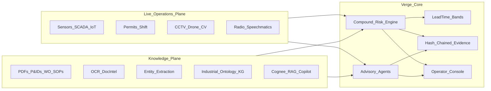

# Verge — National AI Summit Master Plan

**Date:** 2026-07-17 (revised)  
**Product:** Verge — Industrial Intelligence Platform  
**Stage:** `v0.3.0` Horizon-0/1 scaffold → **Summit-grade dual wedge**  
**Venues:** National AI Summit presentation + multi-industry demo (not limited to one factory)  
**Data posture:** Streams (sensors, CCTV, drone, radio, documents) will be supplied — plan assumes **real ingest**, not permanent mocks  
**Tech posture:** OSS-first; paid only where usefulness demands it (Cognee, Speechmatics, aimlapi, Vultr already in-play).  

**Deep phased plan (stack + DoD + week-by-week):** see [`PHASED_BUILD_PLAN.md`](./PHASED_BUILD_PLAN.md).

---

## 0. Reframed thesis (what we are actually building)

Two challenge statements, **one product**.

| Challenge | Theme | Verge wedge name |
|---|---|---|
| **A — Zero-harm operations** | Industrial Safety Intelligence | **Live Risk** — compound risk, lead-time bands, SIMOPS, emergency, geo |
| **B — Knowledge fragmentation** | Document / Knowledge / Quality Intelligence | **Living Knowledge** — ingest, ontology/KG, expert copilot, RCA, compliance, lessons learned |

**One-line positioning for the summit:**

> Verge is the industrial intelligence layer that connects *what the plant is doing right now* (sensors, permits, CCTV, radio) with *what the organisation already knows* (P&IDs, SOPs, work orders, inspections, regulations) — so risk is predicted in the lead time, and answers arrive with citations at the point of need.

That fusion is the differentiator. Safety-only tools ignore the document cliff. Document-only copilots ignore the gas reading that is rising during hot work. Verge sits on the seam.



**Non-negotiable (keep forever):**
- **P1** — Detection → alert path is deterministic / classic ML, LLM-independent.  
- **P4** — Never fabricate. Degrade honestly.  
- **P5** — Eval-driven claims only.  
- **P8** — Decision support, not ESD/PLC write.

---

## 1. Where the current codebase sits (honest baseline)

### Already strong (Challenge A spine)
| Capability | Maturity | Code |
|---|---|---|
| Compound risk rules (33) + 3 predicates | Pilot | `services/risk-engine` |
| Lead-time bands | Pilot | `services/forecaster` |
| SIMOPS permit conflicts | Pilot | `services/permit` |
| Eval vs B0/B1/B2 + FNR | Demo-strong | `eval/` |
| Twin / commissioning / plume / workers | Pilot skeleton | `services/twin` |
| Emergency declare/muster/freeze | Pilot | API emergency + console |
| Investigator agent (tool loop) | Pilot advisory | `packages/agents` |
| Console Instrument Paper | Partial premium | `apps/console` |
| Vision plane (Ultralytics + optional VLM PPE) | Scaffold | `services/vision` |
| Voice (Speechmatics handover/near-miss) | Scaffold | `services/voice` |
| Memory (Cognee) | Scaffold + stub corpus | `packages/memory` |
| Compliance gap + CAPA | Heuristic | `services/compliance` |

### Thin / missing (Challenge B spine — the big summit gap)
| Capability | Status today | Gap |
|---|---|---|
| Universal document ingestion | **Missing as product** | Only seed corpus + finding ingest hooks |
| P&ID / drawing CV digitisation | **Missing** | Vision is PPE/person, not drawings |
| Industrial ontology + auto KG from docs | **Partial** | Twin adjacency + optional Neo4j; UI graph fake |
| Expert Knowledge Copilot (mobile) | **Partial** | `/api/memory/query` + KnowledgePanel; not field-first |
| Maintenance Intelligence / RCA agent | **Missing** | CMMS connector demos only |
| Lessons Learned engine | **Partial** | Near-miss → Cognee ingest; no pattern push system |
| Cross-doc entity extraction eval | **Missing** | No NER benchmark harness |
| Multi-process industry packs | **Partial** | Vizag coke, Jaipur tank, BP Texas packs only |

### Scorecard vs summit dual product (0–100)

| Domain | Score | Notes |
|---|---:|---|
| Safety live risk wedge | **62** | Real brain; still demo-seeded UI |
| Knowledge / document wedge | **18** | Cognee hook only — not a knowledge product yet |
| Vision (ops + drone + PPE) | **28** | Pipeline exists; drawing/OCR not built |
| Voice / radio intelligence | **35** | Speechmatics wired; radio→KG→risk not closed |
| Multi-industry process coverage | **25** | 3 plant packs; need pack library |
| Premium console craft | **55** | Core strong; graph/fleet/admin weak |
| Eval (safety metrics) | **60** | Self-graded replays |
| Eval (knowledge metrics) | **5** | Not built |
| **Overall summit product** | **~34** | A-spine carries; B-spine must be built hard |

---

## 2. Summit product definition (what judges / audience must see)

### Demo narrative (one continuous story, ~8–10 minutes)

**Act 1 — Living Knowledge (Challenge B)**  
Field tech asks on mobile: *“What’s the isolation procedure and last failure mode for Pump P-3 before hot work?”*  
→ Copilot answers with citations from SOP + OEM manual + last 3 work orders + inspection NCR.  
→ Graph view shows Equipment↔Document↔Permit↔Failure links.

**Act 2 — Live Risk (Challenge A)**  
Same zone: gas LEL rising + hot-work permit + shift changeover + radio chatter mentions “smell” / “wait for clearance.”  
→ Compound finding in NEAR band with lineage (sensors + permit + shift + voice snippet + related SOP clause).  
→ Map heatmap + worker exposure.

**Act 3 — Fusion (the Verge moment)**  
Investigator agent joins live telemetry + KG docs + OISD clause → cited brief.  
Maintenance/RCA agent proposes: *similar failure pattern in 2022 WO-…; recommend pause hot work; CAPA already open.*  
Compliance pack shows gap if procedure revision is stale vs regulation.

**Act 4 — Proof**  
Eval panel: safety FNR vs baselines + knowledge benchmark (entity F1, citation accuracy, time-to-answer).  
Emergency tabletop: declare → freeze evidence → muster.

**Act 5 — Multi-process switch**  
Toggle plant pack: Steel / Refinery / Chemicals / Power (or 3 packs) — same UI, different twin + rules + corpus. Proves platform, not one-off.

### Surfaces the console must own (IA)

| Surface | Purpose | Priority |
|---|---|---|
| **Mission Control** | Live risk board + map + now-strip | P0 |
| **Knowledge** | Copilot + corpus browser + citations | P0 (new) |
| **Graph** | Real ontology explorer (equipment–doc–permit–risk) | P0 |
| **Maintenance / RCA** | WO history + recommendations + schedules | P0 (new) |
| **Compliance / QMS** | Gaps, evidence packs, CAPA | P0 expand |
| **Vision Ops** | CCTV/drone lanes, detections, drawing digitiser | P1 |
| **Voice Ops** | Radio transcript stream → structured events | P1 |
| **Replay / Eval** | Safety + knowledge scorecards | P0 |
| **Commission / Admin** | Plant packs, connectors, models | P1 |
| **Fleet** | Multi-site only when real; else hide | P2 |

---

## 3. Industry & process coverage (breadth without chaos)

Do **not** hardcode one factory forever. Ship a **Plant Pack** system:

```text
plants/
  packs/
    steel-coke-oven/       # Vizag-class (existing)
    refinery-tank-farm/    # Jaipur-class (existing)
    petrochem-raffinate/   # BP Texas-class (existing)
    chemicals-batch/       # NEW
    power-thermal/         # NEW
    cement-kiln/           # NEW (optional)
    pharma-api/            # NEW (optional)
```

Each pack contains:
1. Twin (zones GeoJSON, adjacency, equipment, sensors, thresholds)  
2. Rules overlay (process-specific compound combinations)  
3. Document corpus seed (SOPs, P&IDs samples, WOs, inspections, regs subset)  
4. Ontology extensions (equipment classes, permit kinds, failure modes)  
5. Eval fixtures (1 safety replay + 1 knowledge Q&A set)  
6. Vision scenarios (PPE zones, optional drawing samples)  

**Summit demo:** 3 packs live-switchable.  
**Father's plant / any real site:** another pack commissioned from their data — same product.

Process hazards to encode across packs (predicate + rule library growth):

| Process family | Sensors | Permits / work | Knowledge artifacts |
|---|---|---|---|
| Coke / steel gas | LEL, CO, H2S, pressure, temp | Hot work, confined space, LOTO | Battery SOPs, gas procedures |
| Tank farm / transfer | Level, vapor, temp, wind | Hot work, transfer | P&IDs, overflow RCA |
| Batch chemicals | Temp, pressure, pH, flow | Line break, vessel entry | Batch records, MOC |
| Power / boiler | Flame, O2, steam pressure | Isolation, work at height | OEM manuals, trip logs |
| General mechanical | Vibration, bearing temp | LOTO, lifting | WO history, failure codes |

---

## 4. Technology map (use what you already pay for)

| Layer | Technology | Role in Verge |
|---|---|---|
| LLM / VLM | **aimlapi** (+ optional Vultr GPU vLLM/Ollama) | Copilot synthesis, investigator, PPE VLM, report narrative |
| Knowledge / RAG / graph memory | **Cognee** | Document cognify, retrieval, dataset per site/pack |
| Speech | **Speechmatics** | Radio + handover + near-miss → transcript → structured events → KG |
| GPU compute | **Vultr** (or local) | YOLO/RT-DETR, Whisper fallback, embedding jobs, P&ID CV |
| CV | **Ultralytics / OpenCV** | PPE, person/zone, drone analytics; later P&ID line/symbol |
| OCR / Doc intel | **Docling / Unstructured / PaddleOCR / Azure DI-class** (pick 1–2) | PDF/scan → text+layout → entities |
| Graph DB | **Neo4j** | Industrial ontology persistence + Graph UI |
| Time-series | **TimescaleDB** | Sensor history for RCA + charts |
| Objects | **MinIO** | Documents, frames, evidence packs |
| Bus | **Redpanda** | Canonical live events |
| Auth | **Keycloak** | Summit demo roles (Officer, Tech, Auditor) |
| Console | React + MapLibre + Instrument Paper | Premium ops UX |

**Routing rule:** cheap/local models for high-volume (embeddings, OCR cleanup, classification); large aimlapi models for synthesis and investigation only.

---

## 5. Architecture — six planes (expanded)

```text
① EDGE / MEDIA
   MQTT, OPC-UA, RTSP (CCTV/drone), radio audio sink, file drop (docs)
② STREAM BUS
   Redpanda: readings | permits | vision | voice | doc.events
③ DATA
   Timescale · Postgres/PostGIS · Neo4j · Cognee/pgvector · MinIO
④ LIVE INTELLIGENCE (LLM-free safety core)
   risk-engine · forecaster · permit SIMOPS · sensor-health · twin
⑤ KNOWLEDGE INTELLIGENCE (new product spine)
   ingest · OCR · NER/entity · ontology sync · RAG · RCA · lessons
⑥ APPLICATION
   FastAPI · SSE/WS · Console (Mission Control + Knowledge + Graph)
```

### New services / packages to add

| Path | Responsibility |
|---|---|
| `services/docintel/` | Ingest pipeline: PDF/scan/xlsx/email → normalized DocumentAsset |
| `packages/ontology/` | Industrial entity types, relation schema, pack extensions |
| `services/kg/` or expand twin+Neo4j | Upsert entities/relations from docintel + live events |
| `packages/memory/` expand | Multi-corpus datasets; citation contract; air-gap mirror |
| `services/maintenance/` | WO fusion, RCA agent, schedule suggestions |
| `services/lessons/` | Pattern mining over incidents/NCR/near-miss → push warnings |
| `eval/knowledge/` | Entity F1, citation accuracy, time-to-answer, graph completeness |
| Console routes | `/knowledge`, `/graph`, `/maintenance` |

Keep `risk-engine` dependency-clean: knowledge signals enter as **canonical events** or **predicate inputs** (e.g. `procedure_stale`, `open_capa`, `radio_hazard_mention`), never as free-form LLM calls inside the safety loop.

---

## 6. Feature buildout (micro-level, by wedge)

### Wedge A — Live Risk (expand what exists)

#### A1 Truth gate (week 0–1)
- Seed/demo opt-in only  
- Kill fake graph, fake muster `42/43`, fake fleet TRIR/bulletins, fake photo attach  
- Every panel: live API or honest empty  

#### A2 Sensor universe (week 1–3)
Canonical kinds beyond gas: `wind`, `temp`, `pressure`, `level`, `vibration`, `o2`, `h2s`, `nh3`, `cl2`, `flame`, `flow`…  
Predicate expansion:
- `sensor_near_threshold` (generalise gas-only)  
- `maintenance_open`  
- `worker_in_zone` / `exposure_count`  
- `adjacent_permit`  
- `vision_detection`  
- `radio_hazard_mention` (from structured voice events)  
- `procedure_gap` / `open_capa` (from knowledge plane facts, not LLM)

#### A3 Vision ops (week 2–5)
- Live RTSP / file / drone clip → `services/vision`  
- Lanes: person, PPE, zone intrusion, smoke/fire (as models allow)  
- Frame lineage into findings (`frame:` refs in MinIO)  
- Dashboard: camera grid + detection timeline  

#### A4 Voice / radio ops (week 2–4)
- Continuous or chunked radio → Speechmatics  
- Structure: hazard keywords, callouts, clearance language  
- Emit `voice-event` canonical → risk predicates + KG  
- Handover + near-miss already started — extend to live channel  

#### A5 Geo evidence quality (week 2–4)
- Real sensor XY from pack  
- Worker presence + optional RTLS  
- Map fly-to + scrub  
- Metric: `geo_evidence_score`  

#### A6 Emergency + orchestrator polish (week 3–5)
- UI 100% API-bound  
- Multichannel alert preview (SMS/PA degrade-honest)  
- Evidence freeze in demo path  

### Wedge B — Living Knowledge (build the missing product)

#### B1 Universal Document Ingestion (week 1–4) — **critical path**
Pipeline stages:
1. **Acquire** — upload API, folder watch, email archive import, CMMS export  
2. **Classify** — SOP / P&ID / WO / inspection / NCR / permit / drawing / email  
3. **Extract text** — OCR for scans; native text for digital PDFs; tables from xlsx  
4. **Layout** — page/section/blocks for citation deep-links  
5. **Entity extract** — equipment tags, params, people, dates, clause refs, failure codes  
6. **Link** — resolve entities to twin equipment IDs / zone IDs  
7. **Cognify** — Cognee dataset + Neo4j upsert  
8. **Version** — document revision tracking (MOC awareness)

APIs (sketch):
- `POST /api/docs/ingest`  
- `GET /api/docs` / `GET /api/docs/{id}`  
- `GET /api/docs/{id}/entities`  
- `POST /api/docs/{id}/reprocess`  

#### B2 Industrial Ontology & Knowledge Graph (week 2–6)
Entity types: `Equipment`, `Zone`, `Document`, `Clause`, `WorkOrder`, `FailureMode`, `Permit`, `Person`, `Sensor`, `Finding`, `CAPA`, `ProcedureStep`.  
Relations: `DOCUMENTS`, `APPLIES_TO`, `LOCATED_IN`, `FAILED_AS`, `CITED_BY`, `ADJACENT`, `REQUIRES_PERMIT`, `SUPERSEDES`, …  

Console Graph Explorer replaces hardcoded `KnowledgeGraphViz`.

Metric: **linkage completeness** = % extracted equipment tags resolved to twin nodes.

#### B3 Expert Knowledge Copilot (week 3–6)
- Desktop Knowledge surface + **mobile field mode**  
- Citations mandatory (doc id, page/section, confidence)  
- Confidence + “insufficient corpus” honest states  
- aimlapi synthesis grounded only on retrieved chunks (same pattern as orchestrator reports)  

Benchmark: domain-expert question set per plant pack (50–100 Q).  
Metrics: answer quality (human rubric), citation precision, time-to-answer vs keyword search baseline.

#### B4 Maintenance Intelligence & RCA Agent (week 4–8)
Inputs: WO history, failure records, OEM manuals, inspections, live operating conditions (Timescale).  
Outputs: predictive recommendations, RCA hypotheses with evidence, schedule optimisation suggestions.  
Agent tools: query WO, query sensor window, query manuals via RAG, query similar failures in KG.

#### B5 Quality & Regulatory Compliance Intelligence (week 3–7)
Expand beyond OISD stubs:
- Factory Act, PESO, environmental norms, ISO/QMS mappings (pack-selected)  
- Map requirements → procedures → equipment state → inspection evidence  
- Auto evidence packages (already started) + gap accuracy eval  

#### B6 Lessons Learned & Failure Intelligence (week 5–8)
- Mine incidents, near-miss, audit findings, NCRs (internal + optional external CSB/HSE corpora)  
- Detect systemic patterns  
- **Push** warnings into Mission Control when live conditions rhyme with a past lesson  
- Closes the loop from Challenge B → Challenge A  

---

## 7. Evaluation program (both challenge scorecards)

### Safety eval (existing → expand)
| Metric | Method |
|---|---|
| Lead time vs breach | `eval/harness.py` |
| FNR vs B0/B1/B2 | aggregate FNR table |
| Band calibration | band vs minutes-to-breach |
| Compound-only catch rate | **NEW** — findings baselines all miss |
| Geo evidence quality | **NEW** — resolvable polygon + sensor XY + lineage |
| FPR | FindingFeedback in shadow |

### Knowledge eval (`eval/knowledge/` — NEW)
| Metric | Method |
|---|---|
| Entity extraction accuracy | Gold NER labels across doc types (PDF/SOP/WO/P&ID text) |
| Query answer quality | Expert rubric on pack Q-set (correctness, groundedness) |
| Citation precision/recall | Gold supporting spans |
| KG linkage completeness | Resolved entities / extracted entities |
| Time-to-answer | Copilot vs traditional search baseline (stopwatch harness) |
| Compliance gap detection accuracy | Gold gaps vs detector on held-out packs |
| Cross-functional discovery | Blind tasks: maint vs ops vs safety finding the same buried fact |

**Summit rule:** every number on a slide is reproduced by a harness command.

---

## 8. Premium UI/UX plan (summit first impression)

Design system stays **Instrument Paper** — elevate, don’t replace.

### Inspiration fusion
| Source | Take |
|---|---|
| Anduril Lattice | Restraint; color only for subject/risk |
| Linear | Keyboard, density, quiet chrome |
| Palantir Foundry | Object-centric: Equipment / Document / Finding as first-class |
| Bloomberg | Dense truth, no decoration |
| Awwwards editorial/industrial | Motion as presence (stream ticks, map fly, focus) |
| Field EHS apps | One-thumb mobile copilot |

### Craft priorities
1. **Mission Control** — one composition: map + lead-time board + living now-strip (sensors + radio + vision chips)  
2. **Knowledge** — chat + citation rail + source preview (PDF page jump)  
3. **Graph** — real Neo4j/twin data, filterable, click → object  
4. **Finding object page** — Timeline / Spatial / Knowledge / Investigate / Respond  
5. **Mobile field** — ask + acknowledge + photo evidence + muster check-in  
6. Kill Admin dump — sectioned Plant IT  
7. Optional **dim wallboard theme** for summit stage display  

### Motion budget (intentional, not noise)
- IMMINENT annunciator (existing)  
- Live stream tick on ribbon  
- Map fly-to on finding select  
- Citation highlight pulse in doc preview  

---

## 9. Data you will provide → how Verge consumes it

| You provide | Ingest path | Lands in |
|---|---|---|
| Gas/wind/etc. sensor streams | MQTT / OPC-UA / CSV→Redpanda | Timescale + risk-engine |
| Live CCTV | RTSP → vision service | Detections + MinIO frames |
| Drone footage | File/RTSP → vision | Same |
| Worker radio audio | Audio sink → Speechmatics | voice-events + transcripts |
| Transcripts / files | docintel + memory ingest | Cognee + MinIO + KG |
| P&IDs / drawings | docintel (+ later CV) | KG + viewer |
| Work orders / inspections | CMMS connector / CSV / API | maintenance + KG |
| Permits / shift logs | permit registry / stream | SIMOPS + risk |
| Regulatory PDFs | compliance packs + RAG corpus | gaps + copilot |

Until a stream arrives: **honest empty / degraded**, plus optional labeled **Demo Pack** mode for offline rehearsal. No silent fake KPIs.

---

## 10. Phased roadmap (summary)

Full week-by-week work, Usefulness DoD, and stack decisions live in  
**[`PHASED_BUILD_PLAN.md`](./PHASED_BUILD_PLAN.md)**. Summary:

| Phase | Focus | ~Duration |
|---|---|---|
| **0** | Foundation & truth gate; keys; pack IDs; schemas | 1 week |
| **1** | Knowledge spine — Docling ingest, KG, cited copilot | 2–3 weeks |
| **2** | Live fusion — sensors, CCTV/drone, radio → findings | 2–3 weeks (∥ 1) |
| **3** | RCA / compliance / lessons agents | 2 weeks |
| **4** | Multi-pack + premium Mission Control / Knowledge UI | 1.5–2 weeks |
| **5** | Summit hardening, eval boards, dry-runs | 1 week |
| **6** | Post-summit real plant scale | ongoing |

**OSS additions locked in plan:** Docling, Docling-Graph, PaddleOCR/Tesseract, pgvector, Faster-Whisper (fallback), Ultralytics/OpenCV, Neo4j Community, pdf.js.  
**Paid keep:** Cognee, Speechmatics, aimlapi, Vultr GPU.  
**Paid contingency only:** Azure DI / Textract if scan entity F1 stays below 0.85; SMS provider if live SMS is a stage beat.

---

## 11. Priority stack (if time is short before summit)

1. **Truth gate** — never demo a fake number  
2. **Document ingest + Copilot + real Graph** — Challenge B becomes real  
3. **Live fusion** — sensor + permit + vision + radio into one finding with citations  
4. **Eval boards** — safety FNR + knowledge benchmarks on screen  
5. **UI craft** — Mission Control + Knowledge look undeniable  
6. **Multi-pack switch** — proves platform breadth  
7. Everything else is depth  

---

## 12. Agent roster (advisory, not safety interlock)

| Agent | Job | Tools over |
|---|---|---|
| **Risk Engine** | Deterministic compound detection | Live events (not an LLM agent) |
| **Investigator** | Cited incident brief | Telemetry, permits, KG, memory, clauses |
| **Knowledge Copilot** | Q&A at point of need | Doc chunks + KG + citations |
| **Doc Intelligence** | Ingest/classify/extract | Files → entities |
| **Maintenance / RCA** | Downtime & failure reasoning | WO + sensors + manuals |
| **Compliance** | Gap + evidence | Clause packs + procedures + inspections |
| **Lessons Learned** | Pattern push | Incidents/NCR/near-miss history |
| **Emergency Orchestrator** | Advisory response choreography | Muster, alerts, freeze |
| **Vision Analyst** | PPE/zone/drone signals | Frames → detections |
| **Voice Analyst** | Radio → structure | Speechmatics transcripts |

Supervisor pattern: shared memory over twin + KG; **no agent writes to PLC**.

---

## 13. Risks specific to summit scope

| Risk | Mitigation |
|---|---|
| Building two half-products | Force fusion demos (Act 3); shared object model |
| LLM theatre without ingest | Docintel before more chat UI |
| Scope explosion across 8 industries | 3 packs for summit; ontology extensible |
| GPU/model flakiness on stage | Degrade banners rehearsed; offline caches for clips |
| Compliance overclaim | “Gap detection” not “certified compliant” |
| Safety core polluted by LLM | CI import lint: risk-engine must not import verge_llm |

---

## 14. Immediate next sessions (with you)

| Session | Goal | Output |
|---|---|---|
| **S1** | Lock 3 summit plant packs + demo script beats | Pack list + 10-min rundown |
| **S2** | Spec `services/docintel` + ontology schema v1 | Entities/relations + API contracts |
| **S3** | Console IA wireframes: Mission Control / Knowledge / Graph | Screen map + component ownership |
| **S4** | Knowledge eval gold set design | 30–50 questions + NER label plan |
| **S5** | Integration runbook for your streams (CCTV, radio, sensors, docs) | Endpoint + topic + folder contracts |
| **S6+** | Build sprints Phase S0→S4 | Working summit product |

---

## 15. Verdict (updated)

You are **not** building “a father’s factory app.” You are building a **National AI Summit–grade Industrial Intelligence platform** with two fused wedges: **Live Risk** and **Living Knowledge**.

Current repo: **strong A-spine, weak B-spine (~18/100).**  
Winning path: keep the deterministic safety core, **pour the next engineering weeks into document intelligence + real KG + copilot + fusion**, wire your real streams as they arrive, and make the UI prove both McKinsey’s knowledge problem and Vizag’s safety problem in one continuous demo.

Father’s plant becomes **Plant Pack N**, not the product definition.

---

## Appendix A — Existing code to reuse (don’t rewrite)

- Risk / forecast / permit / twin / emergency / agents / vision / voice / memory / compliance / eval / console Instrument Paper  
- Cognee client patterns in `packages/memory`  
- Speechmatics patterns in `services/voice`  
- aimlapi via `packages/llm`  
- Neo4j sync hooks in `services/twin`  
- MinIO evidence patterns  

## Appendix B — Related docs

- [`Verge.md`](./Verge.md) — original safety constitution (still binding for P1–P8)  
- [`ARCHITECTURE.md`](./ARCHITECTURE.md)  
- [`backend_architecture_audit.md`](./backend_architecture_audit.md)  
- [`design-system.md`](./design-system.md)  
- [`commissioning.md`](./commissioning.md)  
